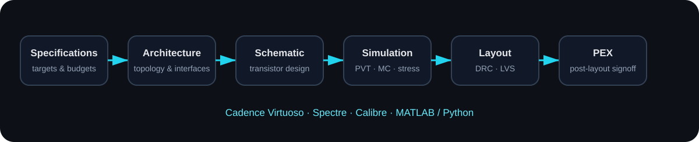

<div align="center">


### Analog IC · Power Management · Mixed-Signal IC

I design, simulate, verify, and document CMOS circuits — with a focus on **power-management ICs**, **analog building blocks**, and **post-layout verification**.

[](#)
[](#)
[](#)
[](#)

</div>

---

## 👋 About Me

I'm **Yichen Jiang (蒋懿辰)**, working in the area of **analog integrated circuits and power management**.

My current interests center on transistor-level CMOS design, power-stage / driver optimization, feedback systems, analog building blocks, and the complete implementation flow from schematic simulation to **DRC / LVS / PEX / post-layout verification**.

I like projects that sit at the boundary between theory and silicon: not only *whether a circuit works*, but also **why it works, where it fails, and how much margin it has across PVT**.

---

## ⚡ Research & Design Interests

<table>
<tr>
<td width="50%" valign="top">

### Power Management IC
- DC-DC converters
- Switched-capacitor / hybrid converters
- LDO regulators
- Gate drivers
- Dead-time / non-overlap control
- Startup & protection
- Power-stage efficiency optimization

</td>
<td width="50%" valign="top">

### Analog / Mixed-Signal IC
- Operational amplifiers / OTAs
- Comparators
- Oscillators
- Bandgap / references
- ADC building blocks
- Feedback & stability
- Behavioral modeling

</td>
</tr>
</table>

---

## 🚀 Featured Projects

### ⚡ 65-nm CMOS DC-DC Converter

**Focus:** power stage, gate driver, non-overlap timing, efficiency, PVT and post-layout verification.

| Item | Design focus |
|---|---|
| Technology | 65-nm CMOS |
| Supply domain | Low-voltage CMOS / PMIC |
| Power stage | High-side / low-side switching devices |
| Timing | Dead-time and non-overlap optimization |
| Verification | Transient, PVT, device stress, post-layout |
| Tools | Virtuoso, Spectre, Calibre |

**Selected engineering topics**
- Gate-driver delay and rise/fall-time trade-offs
- Shoot-through avoidance using device-level conduction criteria
- Efficiency extraction and input-current measurement
- Corner-dependent timing behavior
- PEX-aware transient verification

> Public material is intentionally sanitized: no foundry PDK, rule decks, proprietary models, or restricted process data are published here.

---

### 🔋 CMOS LDO Regulator

**Focus:** reference, error amplifier, pass device, loop stability, regulation, transient response, layout and measurement-oriented verification.

**Key verification dimensions**
- DC operating point
- Line regulation
- Load regulation
- Load transient
- PSRR
- Loop stability
- Temperature / PVT behavior
- Layout-aware simulation

---

### 📡 MIMO Capsule Antenna

A research project on a compact **MIMO antenna for capsule-endoscopy applications**, with emphasis on miniaturization, in-body operation, impedance matching and isolation.

This project complements my IC work with experience in EM-oriented design and system-level engineering.

---

## 🧩 IC Design Workflow

<div align="center">

</div>

---

## 🛠 Engineering Stack

### EDA & Verification
`Cadence Virtuoso` · `Spectre` · `Calibre DRC/LVS/PEX` · `ADE Explorer / Assembler`

### Circuit & Modeling
`CMOS Analog Design` · `PMIC` · `Verilog-A` · `SPICE / Spectre Netlists`

### Computing & Documentation
`MATLAB` · `Python` · `LaTeX` · `Git` · `Markdown`

### Verification Habits
`PVT` · `Monte Carlo` · `Transient` · `AC / STB` · `Stress Checks` · `Post-Layout`

---

## 📚 Topics I'm Building Notes On

- MOS device operation and short-channel effects
- Analog IC fundamentals
- LDO architecture and stability
- DC-DC power stages and gate drivers
- Dead-time / non-overlap design
- Comparator and oscillator design
- ADC fundamentals
- PVT / Monte Carlo methodology
- DRC / LVS / PEX workflow
- Post-layout simulation methodology

---

## 📈 Engineering Philosophy

```text
Specification
    ↓
Architecture
    ↓
Hand Analysis
    ↓
Schematic Design
    ↓
Pre-layout Verification
    ↓
Layout → DRC / LVS
    ↓
PEX
    ↓
Post-layout Verification
    ↓
Measurement / Iteration
```

I prefer to treat verification as part of the design itself: every important result should be tied to a **measurable metric**, a **defined operating condition**, and a **clear margin**.

---

## 📊 GitHub Activity

<p align="center">
  
  
</p>

---

## 📫 Contact

For research collaboration, analog / PMIC discussion, or project exchange, feel free to reach out through my GitHub profile.

> Login credentials, foundry data, proprietary netlists, model files, PDK content, and rule decks are never published in this repository.

---

<div align="center">

**Analog IC · PMIC · Keep designing, measuring, and iterating.**

</div>
